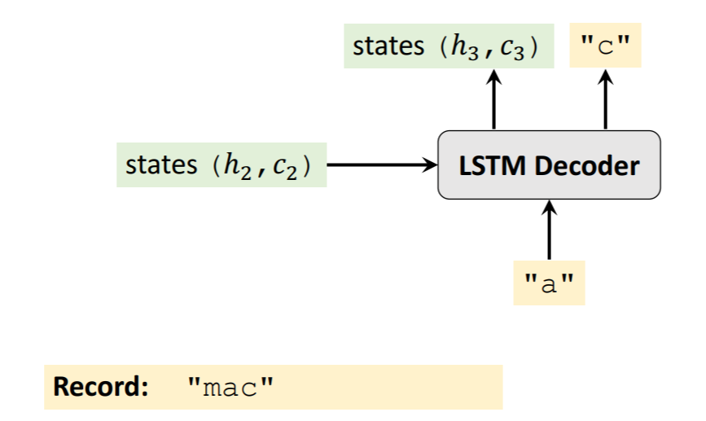

Seq2Seq实现机器翻译

# 步骤

1. 句子切片&创建字典（目标语言的字典中有特殊字符表示起始和终止）

2. One-hot处理，得到矩阵表示的句子

3. Seq2Seq模型

   Encoder&Decoderh

   Encoder是一个LSTM，将英语句子的one-hot表示输入进去，输出最后的状态(h,c)。

   Decoder也是一个LSTM，将Encoder的输出和一部分德语句子作为输入，输出德语句子。先生成预测值，再计算交叉熵，然后反向传播，更新。

   

# 缺陷

LSTM存在梯度消失的问题，长文本的记忆会丢失。

## 解决方法

BiLSTM

Attention（让Decoder考虑Encoder的所有输出，而不是只输入最后的状态）