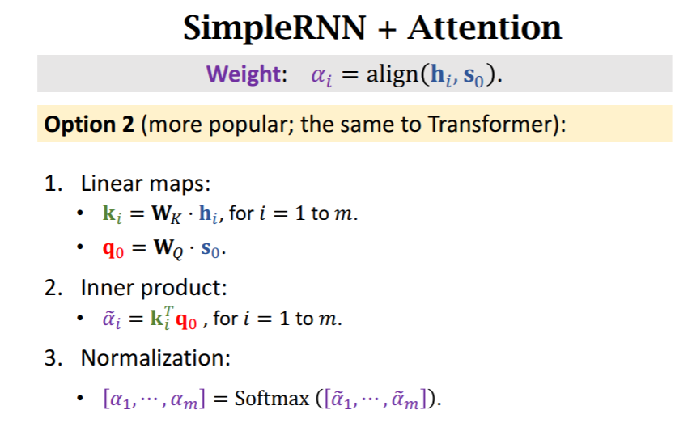
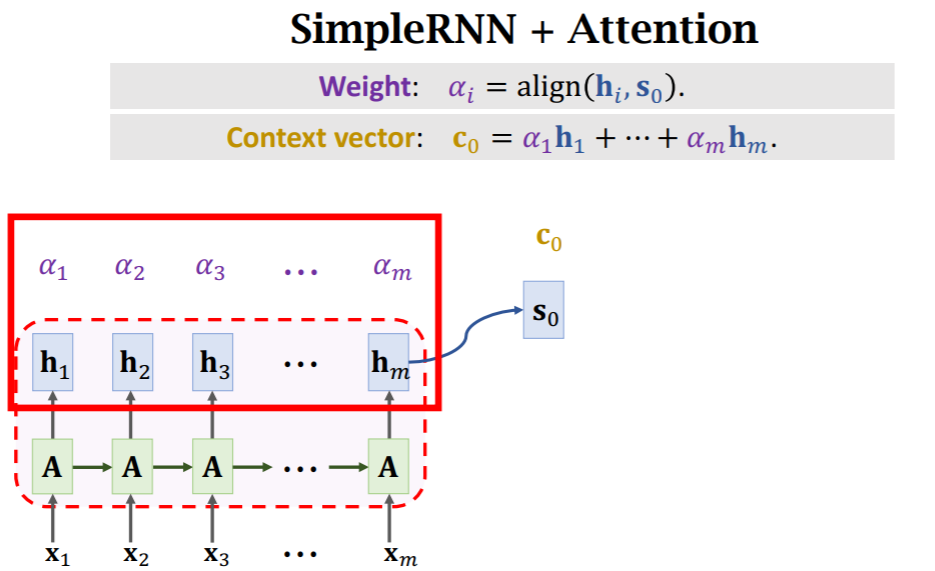
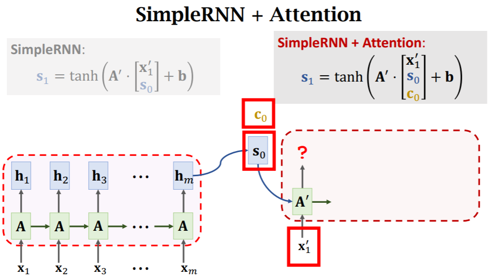
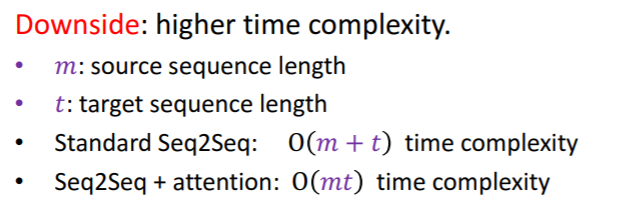

# 步骤

1. 计算weight，$ h_i $与$ s_j $计算$ \alpha_i $

   

2. 通过$ \alpha_i $计算$ c_j $进而将Encoder的所有输出导入Decoder中

   

3. 用Attention改造SimpleRNN

   

4. 依次迭代

   

   

# 优势

1. 将Encoder的所有状态考虑进去了，不只是跟Simple RNN一样只考虑最终状态
2. 有侧重，通过$ \alpha_i $ 将权重考虑进去了

# 缺点

计算量大，Encoder有m层，Decoder有t层，则复杂度为O(mt)

